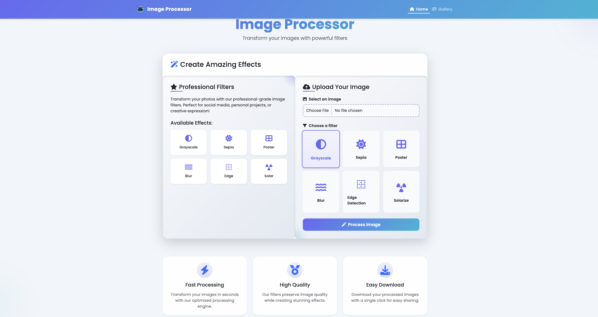

# Django Image Processor

A web-based image processing application built with Django that allows users to apply various filters to their images. The application provides an intuitive interface for uploading images and applying different effects like grayscale, sepia, poster, blur, edge detection, and solarize.

## Features

- 🖼️ Upload images in common formats (JPEG, PNG, GIF)
- 🎨 Six distinct image filters:
  - Grayscale
  - Sepia
  - Poster
  - Blur
  - Edge Detection
  - Solarize
- 📱 Responsive design for all devices
- 🖼️ Gallery view for processed images
- ⬇️ Download processed images
- 🔄 Real-time processing
- 💾 Local storage for both original and processed images

## Interface


*Main interface showing image upload and filter selection*

## Tech Stack

- Django 4.x
- Python 3.11
- Pillow (PIL Fork)
- SQLite3
- HTML5/CSS3/JavaScript
- Bootstrap 5

## Installation

1. Clone the repository
2. Install dependencies:
   ```bash
   pip install django pillow
   ```
3. Run migrations:
   ```bash
   python manage.py migrate
   ```
4. Start the development server:
   ```bash
   python manage.py runserver 0.0.0.0:5000
   ```

## License

This project is licensed under the MIT License - see the LICENSE file for details.
